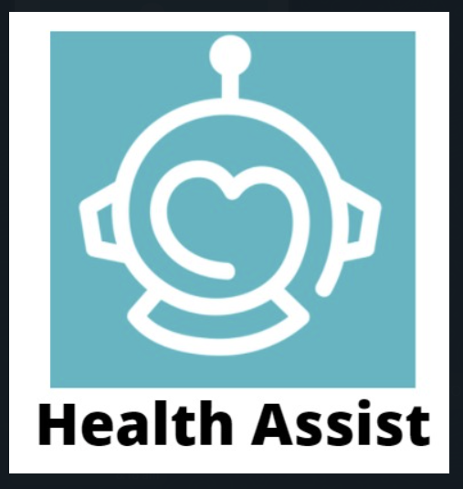

[](https://forthebadge.com) [](https://forthebadge.com)[](https://forthebadge.com) [](https://forthebadge.com)
 <br/>
 
 <p align="center">
  <a href="https://https://github.com/harshmohan07/temp1">
    </a></p>
 
 <p align="center">
    Talk to our <strong>specially trained</strong> chatbot and get <strong>accurate</strong> Medical Diagnosis on some pretrained symptoms.
    <br />
    Also try our <strong>Mental Health Information Provider</strong> to help yourself as well as your family and friends in tough times.
    <br />
    <a href="https://youtu.be/evbLgKM_kMw">View Demo</a>
 
   </p>
</p>
<hr />

* [About the Project](#about-the-project)
  * [More About Disease Suspection in Chatbot](#real-time-analysis)
  * [Usability with Doctors Point of View](#notifications)
  * [Built With](#built-with)
* [Getting Started](#getting-started)
  * [Installation](#installation)
* [Team Members](#team)
* [Contact](#contact)

## About the Project
This project aims to solve the problems of – 

a.)	To provide accurate medical diagnosis up to a certain extent on some pretrained symptoms and diseases using a telegram bot which is available to a large user base. 

b.)	Mental Health is still a stigma in many cultures and knowledge and information about it is as important as physical health. Keeping this in mind we have designed a Mental Health information bot to help people understand mental health issues.

c.) We have integrated all of these in an app that redirects the users to these bots and also provides a medication scheduler. Some other features under development are : Providing nearby pharmacy, providing contacts of Doctors and Hospitals depending on users locations and the diseases suspected.

### More About Disease Suspection in Chatbot
We have collected some limited data of diseases in which the main symptomes which prevail are Chest Pain and Stomach Ache. 
We ask user about some more accompayning symptomes in text format which will reduce the number of questions which will be answerd by the user as compared to conventional chatbots. 
After this, some pin pointed questions related to symptoms provided by the user will be asked and this will be followed by general history of the user, which is also integral part of the diagnosis.
Depending on all the factors mentioned above, some diseases which match with users responses will be given as suspected diseases and some informative links from trused sights will be provided to the user.

### Usability with Doctors Point of View
We will provide a PDF which will contain all the symptoms user has texted to our chat bot and also the answers of the pin pointed questions.
This will help doctor to gain a lot of insights about the disease even before talking to the patient. He can directly jump to clinical examinations part and it will save his time and efforts.

### Built With 
<p float = "left">

 


 

</p>

## Getting Started

### Requirements
* Python >= 3.8.0
* TensorFlow
* NLTK
* Telegram
* Firestore

### Installation
* Clone the repository : 
```sh 
git clone https://github.com/Vedanshi-Shah/CoVigilance.git 
```

#### Telegram Bots
* Run the main.py file for starting the bots : 
```sh 
python main.py
```

#### Mobile App 

* For  : 
```sh 
npm i
expo start
```

## Tech Stack
* Backend
  * Python <br/>
* Database
  * Firestore <br/>
* Frontend
  * React Native <br/>
* Libraries
  * TensorFlow
  * NLTK
  * PyTorch <br/>

## Project made by
1. [Om Khare](https://github.com/OmKhare)
2. [Harshmohan Kulkarni](https://github.com/harshmohan07)
3. [Prerna Tulsiani](https://github.com/pt3002)
4. [Vedanshi Shah](https://github.com/Vedanshi-Shah)
